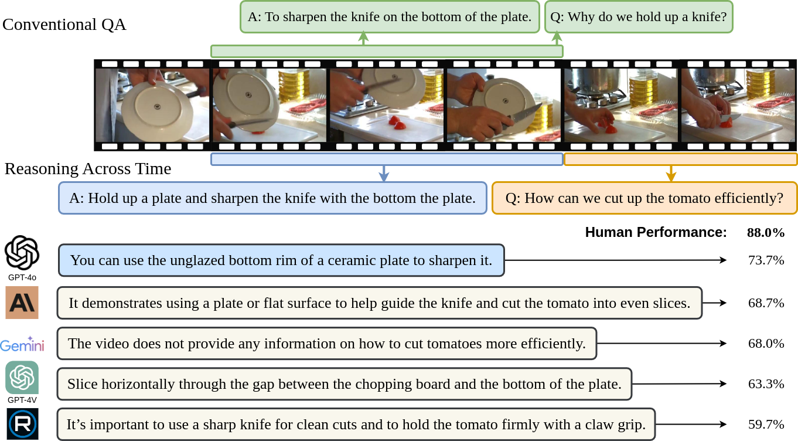

# ReXTime: A Benchmark Suite for Reasoning-Across-Time in Videos

ReXTime is designed to test AI models' temporal reasoning within video events, focusing on understanding cause-and-effect across different video segments, with 921 validation samples and 2,143 test samples.

|[**Project Page**](https://rextime.github.io/) | [**Github**](https://github.com/ReXTime/ReXTime) | [**🏆Leaderboard**](https://eval.ai/web/challenges/challenge-page/2326/overview) | [**📖Paper**]() |



## Table of Contents

* [Getting Started](#getting-started)
    * [Prerequisites](#prerequisites)
    * [Training](#training)
    * [Inference](#inference)
    * [Pretraining and Finetuning](#pretraining-and-finetuning)
    * [Evaluation and Codalab Submission](#evaluation-and-codalab-submission)
    * [Train Moment-DETR on your own dataset](#train-moment-detr-on-your-own-dataset)
* [Demo: Run predictions on your own videos and queries](#run-predictions-on-your-own-videos-and-queries)
* [Acknowledgement](#acknowledgement)
* [LICENSE](#license)

## Getting Started 

### Prerequisites
0. Clone this repo

```
git clone https://github.com/ReXTime/ReXTime.git
cd ReXTime
```

1. ActivityNet Source Video Downloading

Download the raw video data from the [Download page](http://activity-net.org/download.html) at ActivityNet official website. You need to fill in their request form to have a 7-day-access to download the videos from the drive folders. You can find the [form](https://docs.google.com/forms/d/e/1FAIpQLSeKaFq9ZfcmZ7W0B0PbEhfbTHY41GeEgwsa7WobJgGUhn4DTQ/viewform) here.

2. QVHighlights Source Video Downloading

Download raw video data from the [link]((https://nlp.cs.unc.edu/data/jielei/qvh/qvhilights_videos.tar.gz)) provided by [Moment-DETR](https://github.com/jayleicn/moment_detr). Extract the file.
```
tar -xvzf qvhilights_videos.tar.gz
```

3. Directory Structure

```
.
├── videos/                                     # Path to the QVHighlights raw videos, can be anywhere.
│   ├── 9c_w8HU3hqc_210.0_360.0.mp4             # Video 1
│   └── efCSWDWjm6g_360.0_510.0.mp4             # Video 2
├── Anet_videos_15fps_short256/                 # Path to the ActivityNet raw videos, can be anywhere.
│   ├── v_5R3h6lxne90.mp4                       # Video 1
│   └── v_aQ-F9wr0HQ4.mp4                       # Video 2
├── ReXTime/                                    # Contains the annotations for Dataset splits
│   ├── evaluation/                             # Evaluation code
│   └── demo.py                                 # Huggingface demo script
...
```

4. Install dependencies.

```
conda create --name=rextime python=3.10 -y
conda activate rextime
pip install -r requirements.txt
```

## Inference demo
import os, json
from PIL import Image
import requests
import numpy as np
import av
import torch
from huggingface_hub import hf_hub_download
from datasets import load_dataset
from transformers import VideoLlavaProcessor, VideoLlavaForConditionalGeneration
from transformers import BitsAndBytesConfig

def read_video_pyav(container, indices):
    '''
    Decode the video with PyAV decoder.
    Args:
        container (`av.container.input.InputContainer`): PyAV container.
        indices (`List[int]`): List of frame indices to decode.
    Returns:
        result (np.ndarray): np array of decoded frames of shape (num_frames, height, width, 3).
    '''
    frames = []
    container.seek(0)
    start_index = indices[0]
    end_index = indices[-1]
    for i, frame in enumerate(container.decode(video=0)):
        if i > end_index:
            break
        if i >= start_index and i in indices:
            frames.append(frame)
    return np.stack([x.to_ndarray(format="rgb24") for x in frames])

data_file = '/home/shinji106/ntu/PrivateEval/rextime/ReXTime/data/rextime_val.json'
anet_vid_dir = '/home/shinji106/Data/ActivityNet/Anet_videos_15fps_short256'
qvh_vid_dir = '/data/ntu/videos'

# TODO: Replace with Huggingface dataset
with open(data_file, 'r') as f:
    data = json.load(f)
input_data = data[0]
# dataset = load_dataset("ReXTime", split="test")
# breakpoint()

# Set the device
device = torch.device("cuda" if torch.cuda.is_available() else "cpu")

# Enable 4-bit quantization
bnb_config = BitsAndBytesConfig(
    load_in_4bit=True,
    bnb_4bit_quant_type='nf4',  # Choose quantization type, nf4 or fp4
    bnb_4bit_use_double_quant=True,  # Optional: improves performance but requires more memory
    bnb_4bit_compute_dtype=torch.float16  # Set compute dtype to float16 for faster computation
)

# Load model and processor
model = VideoLlavaForConditionalGeneration.from_pretrained(
    "LanguageBind/Video-LLaVA-7B-hf",
    quantization_config=bnb_config,
    low_cpu_mem_usage=True
)
processor = VideoLlavaProcessor.from_pretrained("LanguageBind/Video-LLaVA-7B-hf")

# Input configuration
# prompt = "USER: <video>Why is this video funny? ASSISTANT:"
# video_path = hf_hub_download(repo_id="raushan-testing-hf/videos-test", filename="sample_demo_1.mp4", repo_type="dataset")
prompt = f"USER: <video>{input_data['question']} ASSISTANT: "
if input_data['source'] == "qvhighlights_val":
    video_path = os.path.join(qvh_vid_dir, input_data['vid'] + '.mp4')
else:
    video_path = os.path.join(anet_vid_dir, input_data['vid'] + '.mp4')
container = av.open(video_path)

prompts = []
for option in input_data['options']:
    sentence = input_data['answer'].replace("<s0>", str(input_data['span'][0]))
    sentence = sentence.replace("<e0>", str(input_data['span'][1]))
    sentence = sentence.replace("<option>", option)
    prompts.append(prompt + sentence)

# Sample uniformly 8 frames from the video
total_frames = container.streams.video[0].frames
indices = np.arange(0, total_frames, total_frames / 8).astype(int)
clip = read_video_pyav(container, indices)

# inputs = processor(text=prompt, videos=clip, return_tensors="pt", padding=True).to(device)
clips = [clip for _ in range(len(prompts))]
inputs = processor(text=prompts, videos=clips, return_tensors="pt", padding=True).to(device)

# Inference to get the logits
output = model(**inputs)

# Alternatively, you can also feed the labels to the model to compute the loss as scores.
preds = []
for opt in range(len(prompts)):
    # breakpoint()
    # 6 is the length of input_ids which is ahead of the image tokens, here we only consider the scores after the image tokens.
    sentence_length = inputs['input_ids'][opt].shape[0] - 6
    scores = tuple([i.unsqueeze(0) for i in output['logits'][opt]][-sentence_length-1:-1])
    output_scores = model.compute_transition_scores(inputs['input_ids'][opt].unsqueeze(0)[:, 6:], scores, normalize_logits=True)
    score = sum(output_scores[0].cpu().tolist()) / len(output_scores[0])
    preds.append(score)

# generate_ids = model.generate(**inputs, max_length=80)
# output = processor.batch_decode(generate_ids, skip_special_tokens=True, clean_up_tokenization_spaces=False)[0]

# Output the result
mapping = {0: 'A', 1: 'B', 2: 'C', 3: 'D'}
pred_ans  = mapping[preds.index(max(preds))]
print(pred_ans == input_data['ans'])

```

## Evaluation

This is an example of output/submission file in .jsonl format. For the assessment of moment grounding, you only need to provide "qid" and "pred_relevant_windows". For the assessment of multi-choice VQA, you only need to provide "qid" and "ans". For the assessment of grounding VQA, you need to provide "qid" "pred_relevant_windows" and "ans" in your submission file.
```
{"qid": "anet_val384", "pred_relevant_windows": [[0.0, 15.8304]], "ans": "A"}
{"qid": "qvh_val114", "pred_relevant_windows": [[0.0, 25.50]], "ans": "A"}
...
```

Modify the submission file path in ./evaluation/eval_sample.sh and run:

```
bash ./evaluation/eval_sample.sh
```

Here we only provide the ground truth file of validation set in 'data/rextime_val.jsonl'. To access on the test set, please submit the predicted file to [ReXTime Leaderboard](https://eval.ai/web/challenges/challenge-page/2326/overview).

## Acknowledgement
* The evaluation code is build from [Moment-detr](https://github.com/jayleicn/moment_detr). 

## License
The annotation files are under [CC BY-NC-SA 4.0](https://creativecommons.org/licenses/by-nc-sa/4.0/) license, see [./data/LICENSE](data/LICENSE). All the code are under [MIT](https://opensource.org/licenses/MIT) license, see [LICENSE](./LICENSE).

<!--
**GTR-Benchmark/GTR-Benchmark** is a ✨ _special_ ✨ repository because its `README.md` (this file) appears on your GitHub profile.

Here are some ideas to get you started:

- 🔭 I’m currently working on ...
- 🌱 I’m currently learning ...
- 👯 I’m looking to collaborate on ...
- 🤔 I’m looking for help with ...
- 💬 Ask me about ...
- 📫 How to reach me: ...
- 😄 Pronouns: ...
- ⚡ Fun fact: ...
-->
